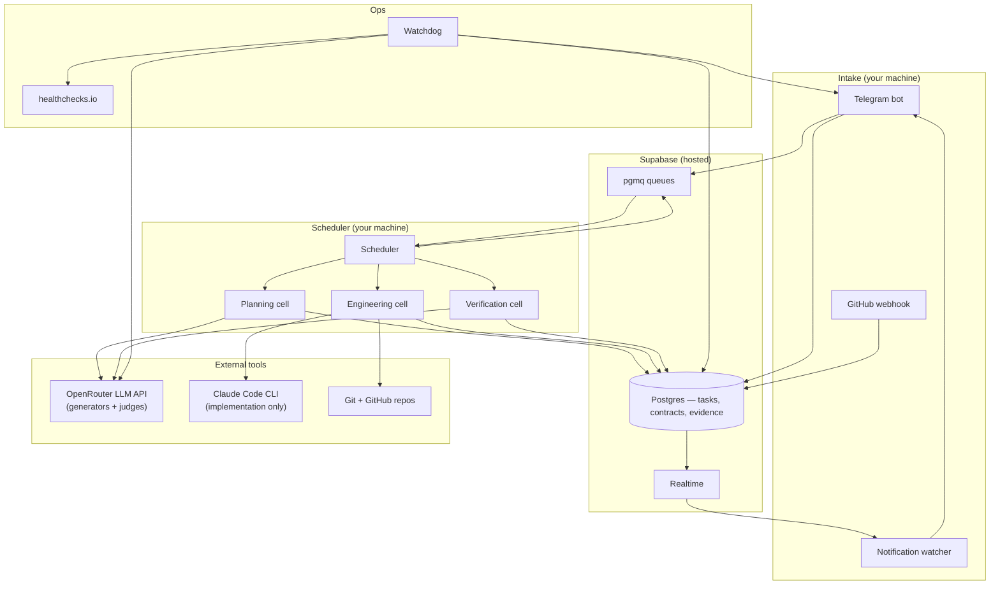

# TaskGraph OS

**A state-centric control plane for agentic software work.**

TaskGraph OS turns a goal into a **task contract**, runs it through specialized **cells** (planning → engineering → verification), collects **evidence**, and only marks work **COMPLETE** when an independent verifier agrees the contract is satisfied. AI workers are replaceable executors; Supabase Postgres is the system of record.

This is not a multi-agent chatroom. It is an operating system for accountable, inspectable work.

---

## How the pieces fit together



| Layer | Where it runs | Role |
|-------|---------------|------|
| **Intake** | Local process (`npm run intake`) | Accepts work via Telegram (long-polling) or GitHub webhook; creates tasks; forwards lifecycle notifications back to Telegram |
| **Scheduler** | Local process (`npm run scheduler`) | Polls Supabase queues, runs cell workflows one job at a time (v1: `SCHEDULER_WORKERS=1`) |
| **Cells** | Inside the scheduler | LangGraph workflows: planning, engineering, verification |
| **Supabase** | Cloud | Durable state: tasks, contracts, artifacts, evidence, verification records, job queues |
| **Watchdog** | Local process (`npm run watchdog`) | Periodic health checks, stuck-task alerts, optional dead-man's switch ping to healthchecks.io |
| **Worktrees** | Local disk (`TASKGRAPH_WORKTREE_ROOT`) | Isolated git clones where engineering edits code and runs tests |

---

## End-to-end: from Telegram to COMPLETE

1. **You send a goal** — plain language in Telegram (conversation flow) or `/task … --repo owner/name`.
2. **Intake** resolves the target repo, scans it for context, creates task `T-NNN`, enqueues `task.plan.requested`.
3. **Planning cell** runs a multi-agent review (Plan A / Plan B / cross-review / consensus), drafts a **contract** (goal, scope, acceptance criteria), validates executability, and **auto-approves** when valid.
4. **Scheduler** auto-enqueues `task.execution.requested` (when `TASKGRAPH_AUTO_ENQUEUE_EXECUTION=true`).
5. **Engineering cell** clones a worktree, writes a one-shot implementation plan (OpenRouter, cheap tier), then **Claude Code CLI** explores the repo and implements; runs tests, commits, assembles evidence.
6. **Scheduler** auto-enqueues `task.verification.requested` (when `TASKGRAPH_AUTO_ENQUEUE_VERIFICATION=true`).
7. **Verification cell** judges each acceptance criterion against diff + evidence via OpenRouter using a **frontier judge model** (`MODEL_VERIFICATION`). Outcomes: **COMPLETE**, **REWORK_REQUIRED** (engineering retry, capped), or **BLOCKED** (contract revision / human).
8. **Intake notification watcher** delivers Telegram updates (Realtime + polling fallback).

```text
Goal → Contract → READY → Engineering → Evidence → Verification → COMPLETE
                              ↑__________________|  (rework loop, max N attempts)
```

**Iteration today:** there is no replan loop inside engineering. A bad `engineering_plan` can still succeed if Claude Code compensates; if not, **verification fails → rework** re-runs the whole engineering cell (new plan + new Claude Code call), up to `TASKGRAPH_MAX_REWORK_ATTEMPTS`.

Task status is always queryable: `/status T-NNN` in Telegram or `npm run smoke:inspect -- T-NNN`.

---

## What each component does

### Intake (`src/intake/`)

| Piece | Does what |
|-------|-----------|
| **Telegram bot** | Commands (`/task`, `/repo`, `/status`, `/reset`) and conversational requirements gathering |
| **Conversation agent** | Turns vague asks into scoped task chains (`MODEL_INTAKE_CONVERSATION` via OpenRouter) |
| **Task creator** | Writes task rows, seed context, enqueues planning |
| **Notification watcher** | Subscribes to `human_notification` artifacts → Telegram (with 60s poll fallback) |
| **GitHub webhook** | Creates tasks from labeled issues (code-complete; needs a public URL in production) |

### Scheduler (`src/scheduler/`)

- Dequeues from pgmq queues (`task.plan.requested`, `task.execution.requested`, `task.verification.requested`, `task.rework.requested`, …).
- Invokes the matching **cell workflow** and records `agent_runs`.
- **Stale job guards** — skips/acks jobs whose task status no longer matches (prevents infinite loops after crashes).
- **Auto-dispatch** — after planning approves or engineering finishes, enqueues the next stage when env flags are on.

### Planning cell (`src/cells/planning/`)

Multi-step LangGraph pipeline grounded on a **repo seed snapshot** (file tree, README excerpt, manifest, test commands, recent commits — from `repo-scanner.ts` at task creation, not live exploration):

- Plan A and Plan B (different models) propose approaches.
- Each plan is reviewed by the other model.
- Consensus merges into a draft contract.
- Contract is revised if executability validation fails.
- On success: auto-approval, transition to **READY**, artifact trail in `artifacts` table.

**Models:** all via **OpenRouter API** — see [Model routing](#model-routing-generators-vs-judges) below. Planning uses multi-model review; contract draft/consensus use frontier-tier models after capability v3 Step 1.

### Engineering cell (`src/cells/engineering/`)

Turns an approved contract into code on a **git worktree**. Graph order:

```text
resolveRepoRoot → createWorktree → npm install → planImplementation → invokeClaudeCode → runTests → commit → evidence
```

| Step | Tool | Repo access |
|------|------|-------------|
| Resolve repo / clone | `git`, optional `GITHUB_TOKEN` | Clone exists before plan |
| Write implementation plan | OpenRouter — `MODEL_ENGINEERING_PLAN` (cheap tier) | **Text snapshot only** — same `planning_context` seed scan (tree, README, manifest, test commands); **no file reads, no agent loop** |
| **Edit files, run tools** | **Claude Code CLI** — `CLAUDE_CODE_COMMAND`, `CLAUDE_CODE_MODEL` | **Full worktree** — explore, edit, shell |
| Run tests | Shell — resolved test commands from contract/packet | Worktree |
| Commit (harness-safe staging) | Cell orchestration — agents must not commit themselves | Worktree |
| Optional PR / auto-integrate | `gh` / merge-on-COMPLETE when enabled | Remote |
| Evidence package | Structured records per acceptance criterion | DB |

**Why two steps (plan + implement)?** v3 strategy: keep **generators cheap**, fund **judges strong**. The OpenRouter plan is a one-shot hint stored as an `implementation_plan` artifact; Claude Code is the real implementer with tools. A weak plan can cause verify failures; recovery is **rework**, not replanning. Planned improvements: scoped file injection (v3 Step 2), inner test-fix loop (Step 4), optional merger of plan into Claude Code only.

```env
CLAUDE_CODE_COMMAND=claude
CLAUDE_CODE_MODEL=claude-sonnet-4-20250514   # optional; empty = CLI default
```

Rework reuses this workflow with defect context from verification.

### Verification cell (`src/cells/verification/`)

- Loads contract, diff, test output, evidence, and binding requirements (`requirements_summary`).
- Calls OpenRouter with **`MODEL_VERIFICATION`** — configured as a **frontier judge** (capability v3: e.g. `anthropic/claude-sonnet-5`), not the same cheap models used for generation.
- Returns per-criterion verdicts; routes failures (implementation → rework; contract ambiguity → contract revision queue).
- On **COMPLETE**: may merge task branch to default when `TASKGRAPH_AUTO_INTEGRATE=true`.

Verification never edits product code — it only judges. Planned (v3 Step 3.5): independent test re-execution, read-only Claude Code audit, ensemble adjudication, calibration evals.

### Watchdog & healthcheck (`scripts/watchdog.ts`, `scripts/healthcheck.ts`)

| Script | Purpose |
|--------|---------|
| `npm run healthcheck` | Deep startup probe — Supabase, OpenRouter key, Claude CLI, git, worktree, Telegram, … |
| `npm run watchdog` | Runtime monitor — stuck tasks, queue depth, disk, credential failures → Telegram |
| `scripts/start-gated.ts` | pm2 entrypoint: healthcheck must pass before scheduler/intake start |

---

## Model routing: generators vs judges

**OpenRouter is the API transport** for all `invokeRoleModel(...)` calls — planning, contract, engineering plan, verification, intake conversation. The **model slug** in `.env` decides capability and cost, not the word "OpenRouter."

| Role | Env var(s) | Tier (capability v3) | Runtime |
|------|------------|----------------------|---------|
| Planning A/B + reviews | `MODEL_PLANNING_*` | Cheap (test profile OK) | OpenRouter |
| Contract draft | `MODEL_CONTRACT_DRAFT` | **Frontier judge** | OpenRouter |
| Planning consensus | `MODEL_PLANNING_CONSENSUS` | **Frontier judge** | OpenRouter |
| Contract revision | `MODEL_CONTRACT_REVISION` | Cheap (for now) | OpenRouter |
| Engineering **plan** (hint) | `MODEL_ENGINEERING_PLAN` | Cheap (for now) | OpenRouter — **no tools**, snapshot context |
| Engineering **implement** | `CLAUDE_CODE_COMMAND`, `CLAUDE_CODE_MODEL` | Your Claude subscription | **Claude Code CLI** |
| **Verification** | `MODEL_VERIFICATION` | **Frontier judge** | OpenRouter |
| Intake conversation | `MODEL_INTAKE_CONVERSATION` | Strong recommended | OpenRouter |

Principle ([`plans/capability-upgrade-v3-frontier.md`](plans/capability-upgrade-v3-frontier.md)): **fund the trust ceiling (verification + contract judgment); keep generation cheap until evals prove a tier matters.**

All OpenRouter roles share one code path: `src/core/model-router.ts` → `https://openrouter.ai/api/v1/chat/completions`.

One engineering run = **one cheap plan call + one Claude Code session** (not parallel coders). `SCHEDULER_WORKERS=1` in production v1 — one cell job at a time system-wide.

---

## Repository layout

```text
src/
  intake/           Telegram, GitHub webhook, notifications, conversation
  scheduler/        Queue polling, cell dispatch, auto-enqueue
  cells/
    planning/       Multi-agent contract pipeline
    engineering/    Worktrees, Claude Code, tests, commits, evidence
    verification/   Independent contract judging
  core/             Types, state machine, model router, executability, notify
  db/               Supabase client, records, queues, retry-fetch

scripts/            CLI tools: healthcheck, watchdog, pipeline, smoke tests, recovery
supabase/migrations SQL schema + pgmq queue wrappers
system-knowledge/   Policies, decisions, ops runbooks (loaded into prompts)
tasks/              Per-task contract YAML and evidence (dogfood / validation)
tests/              Unit tests (tsx --test)
ecosystem.config.cjs  pm2 config for 24/7: scheduler + intake + watchdog
```

---

## Quick start

### 1. Prerequisites

- Node.js 20+
- Supabase project with migrations applied (`supabase/migrations/`)
- [OpenRouter](https://openrouter.ai) API key
- [Claude Code CLI](https://docs.anthropic.com/en/docs/claude-code) installed and authenticated
- `git` on PATH

### 2. Configure

```powershell
cp .env.example .env
# Edit .env: SUPABASE_*, OPENROUTER_API_KEY, TELEGRAM_*, CLAUDE_CODE_*, TASKGRAPH_WORKTREE_ROOT
```

### 3. Verify

```powershell
npm install
npm run typecheck
npm test
npm run healthcheck
```

### 4. Run (development)

Terminal 1 — scheduler:

```powershell
npm run scheduler
```

Terminal 2 — intake (Telegram):

```powershell
npm run intake
```

### 5. Run (24/7 production)

```powershell
npm install -g pm2 pm2-windows-startup
pm2 start ecosystem.config.cjs
pm2 save
# Administrator: scripts/setup-pm2-windows.ps1
```

See **[OPERATIONS.md](OPERATIONS.md)** for recovery runbooks, secret rotation, and pm2 lifecycle.

---

## Useful commands

| Command | Purpose |
|---------|---------|
| `npm run smoke:inspect -- T-010` | Task status, runs, artifacts, evidence, verification |
| `npm run watch:task -- T-010` | Poll until terminal status |
| `npm run pipeline:run -- T-010` | Drive planning → engineering → verification in one script |
| `npm run reseed:hygiene -- T-010` | Clean queues/worktree before re-running a task |
| `npm run recover:verdict -- T-010` | Fix status when verification saved but transition failed |
| `npm run verify:phase3-4` | Automated pm2 + watchdog checks |
| `pm2 logs taskgraph-scheduler` | Live scheduler logs |

---

## Measuring quality: evals, soak, and comparison

### What exists today

| Layer | What | Where |
|-------|------|-------|
| **Unit tests** | Pure functions: executability, verification verdicts, harness guards, health probes, … | `tests/` — `npm test` (~110+ tests) |
| **Ops verification** | pm2 stack, gated start, watchdog alerts | `npm run verify:phase3-4` |
| **Production soak** | 24–72 h unattended run; failure injections; alert latency | [`system-knowledge/operations/soak-2026-07.md`](system-knowledge/operations/soak-2026-07.md) |
| **Manual dogfood** | Real tasks on real repos with full audit trail | Task IDs in [`STATUS.md`](STATUS.md) (e.g. T-008, T-010, T-011/T-012 chain) |

Dogfood proves the pipeline **can** complete, but it is **not a repeatable benchmark**: each task is unique, costs real API/Claude time, and pollutes task history unless you reseed.

### Eval harness (planned — not built yet)

The **capability v3 eval battery** ([`plans/capability-upgrade-v3-frontier.md`](plans/capability-upgrade-v3-frontier.md) Step 3) will add `npm run evals`:

```text
evals/cards/*.json     ← task fixtures (local git repos, no GitHub)
scripts/run-evals.ts   ← drive pipeline, score expectations, write results
evals/results/         ← per-run JSON
evals/HISTORY.md       ← trend line across git SHAs
```

**How a card works:**

1. **Fixture** — JSON defines fake repo files (`fixture.files`) and a goal/context.
2. **Run** — create isolated bare repo + worktree (`T-9xx` task ids, cleaned up after).
3. **Drive** — same path as production: seed planning → `pipeline:run` loop until terminal status.
4. **Score** — compare actual vs `expect`:

```json
{
  "expect": {
    "status": "COMPLETE",
    "max_rework": 1,
    "files_exist": ["src/util.ts"],
    "forbidden_paths": [".taskgraph", "tasks/"]
  }
}
```

**Three pools** (prevent tuning on the test set you optimize against):

| Pool | Use |
|------|-----|
| **dev** | Free to iterate while changing prompts/policies |
| **holdout** | Sealed — run only at step boundaries; never peek while tuning |
| **full-cycle** | Lifecycle failures: broken setup, integration conflicts, dependency install |

**What each run tracks:**

| Metric | Meaning |
|--------|---------|
| Terminal `status` | COMPLETE / BLOCKED / … vs expected |
| **First-attempt success** | COMPLETE without rework |
| **Rework count** | Engineering retries before pass |
| **Wall-clock** | End-to-end time per card |
| **Agent run count** | From `agent_runs` — cost proxy |

**How we compare:**

1. **Baseline** — run full battery **twice** before a change (variance check); commit `evals/results/<date>.json`.
2. **After each v3 step** — re-run battery; append one line to `evals/HISTORY.md`:

   ```text
   date | git_sha | dev_pass_rate | holdout_pass_rate | notes
   ```

3. **Verifier calibration** (Step 3.5d, planned) — cards with **pre-built diffs** that run **verification only**; track **recall** (catch seeded defects) and **precision** (don't block good diffs) on dev vs holdout separately.
4. **Field labels** (Step 7b, planned) — human `/flag T-NNN missed-defect|false-block` and git reversion watcher → real-world confusion matrix in `HISTORY.md`.

Until `npm run evals` lands, model tier changes (like moving `MODEL_VERIFICATION` to frontier) are justified by **dogfood outcomes** and logged in the soak file — not by automated pass-rate deltas.

---

## Documentation index

| Doc | Contents |
|-----|----------|
| [OPERATIONS.md](OPERATIONS.md) | Production checklist, pm2, watchdog, recovery |
| [STATUS.md](STATUS.md) | Milestones, dogfood evidence, current capabilities |
| [project_structure.md](project_structure.md) | Full v1 architecture spec |
| [system-knowledge/](system-knowledge/README.md) | Policies and decisions wired into agent prompts |
| [plans/production-readiness-execution.md](plans/production-readiness-execution.md) | 24/7 rollout task tracker |
| [plans/capability-upgrade-v3-frontier.md](plans/capability-upgrade-v3-frontier.md) | Model tiers, eval harness, verification 2.0 roadmap |

---

## Design principles

- **State over chat** — Tasks, contracts, and evidence live in Postgres; agents are ephemeral.
- **Contracts before code** — Nothing implements until scope and acceptance criteria are explicit and validated.
- **Independent verification** — The verifier does not write product code; engineering does not self-certify.
- **Evidence-gated completion** — COMPLETE requires passing verification, not just a green local run.
- **Fail loud** — Healthcheck gates, watchdog alerts, Telegram notifications, and optional healthchecks.io dead-man's switch.

---

## License

Private — see repository owner.
